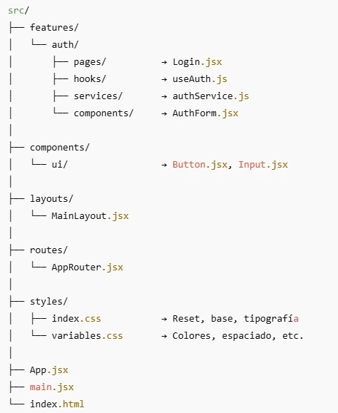

# Pagina de mi portfolio

En este repositorio me dedico a practicar y estudiar con IA como instructor y agilizador conceptos nuevos sobre el desarrollo web.

## Tecnologias usadas en este proyecto

React, Typescript, Vite, React-Router, CSS3 Puro.

## Como esta estructurado este proyecto

Esta fue la idea inicial como decidi estructurar el proyecto para desarrollar mi página de portfolio.

### Por que surge esta idea?

No es por mi egoismo, se que hay personas que lo harían mejor incluso la IA es mejor actualmente, solo decidi
aprender por mi cuenta como estructurar un proyecto ya que en mis antiguas experencias trabajar e investigar a la vez
conforme surgen las problematicas, no es del todo optimo mas si trabajaba en proyectos de finales de carrera (sin una dirección clara).

Durante este proyecto me canse y decidi tomar las riendas y conocer a fondo los conceptos estructurales y esenciales del desarrollo web. Si bien no me las quiero dar de experto ya que incluso habiendo trabajado en este proyecto me he dado cuenta que desconozco muchisimo del campo, ahora doy por hecho que es un área hiperextensa con subramas inmensamente profundas.

#### Aprendizajes

> X para marcar completado, vacio si lo considere pero aun no esta implementado.

**[ X ]** Si bien trate implementar una arquitectura mixta basada en pages y features, así como la ideologia de tener componentes modulares.

**[ X ]** Tener en cuenta el rendimiento de la página.

[ ] Los elementos deben de sumar no restar.

[ ] A veces menos es más.

[ ] Hacer un código perfecto(tardarme + tiempo) a uno funcional, siempre es lo ideal.

[ ] Modularizar los estilos.

[ ] Usar arquitectura de estilado BEM.

[ ] No casarme con el código o identificarme con el.

[ ] Aceptar cualquier critica para mejoras continuas.

[ ] Tener en cuenta el SEO.

[ ] Variables CSS para solo cambiar un color en una página en vez de 15 páginas.

**[ X ]** Aprender diariamente...

##### 
